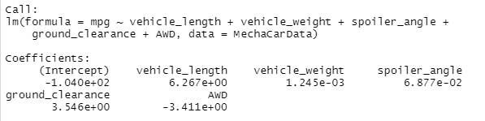
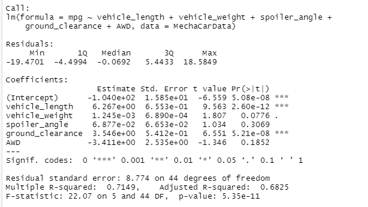
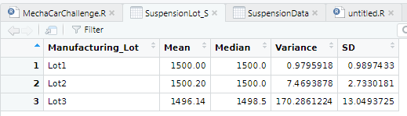
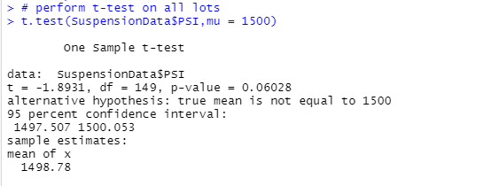
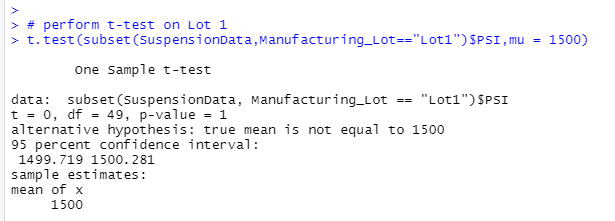
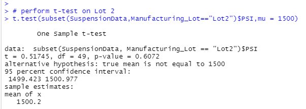
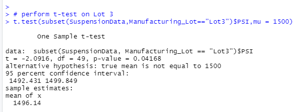

# MechaCar_Statistical_Analysis

### Linear Regress to Predict MPG

The purpose of this analysis was to:

1. Which variables/coefficients provided a non-random amount of variance to the mpg values in the dataset?

 Vehicle weight, spoiler_angle & AWD provided a non-random amount of variance.
 

2. Is the slope of the linear model considered to be zero? Why or why not?

    Our slope is not zero just be looking at the p-value, which is less than 0.05.
    

3. Does this linear model predict mpg of MechaCar prototypes effectively? Why or why not? 

    Our R-squared value is 71%, which means roughly 71% of the time the model will predict mpg values correctly. Ideally, we would want this percentage to be higher, around 85-95%. A simple way of helping the model would be to increase the size of the data.
    

### Summary Statistics on Suspension Coils

1. The design specifications for the MechaCar suspension coils dictate that the variance of the suspension coils must not exceed 100 pounds per square inch. Does the current manufacturing data meet this design specification for all manufacturing lots in total and each lot individually? Why or why not?

    1. Lot 1 has a variance less than 1psi, so it currently meets design specifications.
    2. Lot 2 has a variance less than 7.5psi, so it currently meets design specifications.
    3. Lot 3 has a variance greater than 170psi, so it currently DOES NOT meet design specifications.

### T-Tests on Suspension Coils

Lot 1 and Lot 2 the PSI values are not different from the population mean because our p-values are above our significance level of 0.05. However in Lot 3 the p-value is 0.04168 which is lower than out significance level of 0.05, meaning there is evidence that the suspension coil is different from the population mean. All t-tests can be seen below:

Across all Lots:

Across Lot 1:

Across Lot 2:

Across Lot 3:

### Study Design: MechaCar vs Competition

1. The biggest factor when it comes to car buying is cost.
2. The metrics I would mainly test are fuel efficiency, horsepower, and engine displacement.
3. We can make a Null hypothesis stating that our MechaCar is not so different from the competition and our Alternative hypothesis would be that it IS different from the competition.
4. We can perform our usual t-tests, but I would suggest using an ANOVA test, since we would be interested in comparing means across a number of groups with large real-world data.
5. Data needed to run the tests would include: cost of the vehicle, fuel efficiency, horsepower, engine displacement, etc. from all the different types of car manufacturers.

